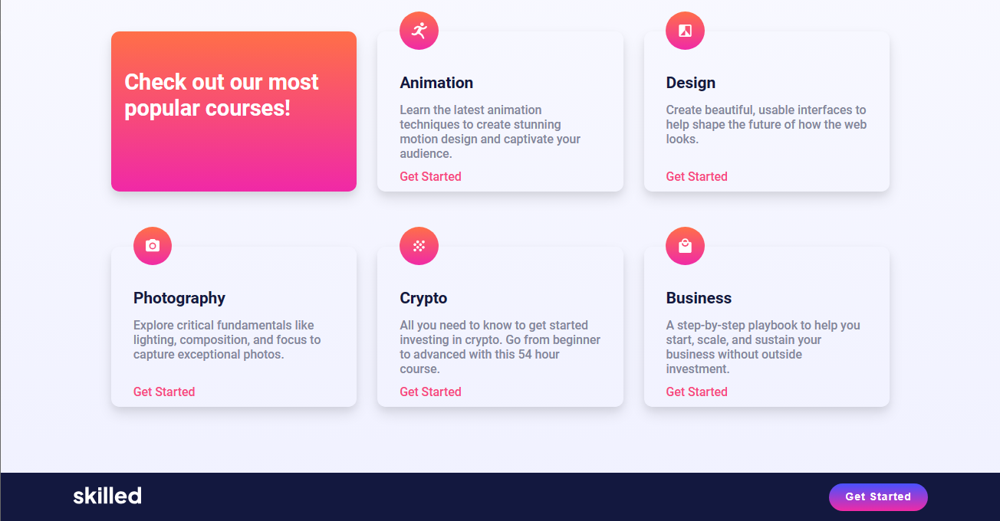

# Frontend Mentor Challenge | Skilled-e-learning-landing-page

This is the solution to the [Skilled e-learning landing page challenge on Frontend Mentor](https://www.frontendmentor.io/solutions/built-with-pure-html-and-css-flexbox-css-grid-prLNqW9I4U). Frontend Mentor challenges help us to improve our coding skills by building realistic projects.   

## Built with

- Semantic HTML5 markup
- CSS custom properties
- Flexbox
- CSS Grid
- Mobile-first workflow

Preview it here - [Skilled e-learning landing page](https://id-dev3.github.io/Skilled-e-learning-landing-page/)   

## Author

- Website - [Black Fury](https://id-dev3.github.io/)
- Frontend Mentor - [@BlackFury117](https://www.frontendmentor.io/profile/BlackFury117)
- Twitter - [@id_dev3](https://twitter.com/id_dev3)
